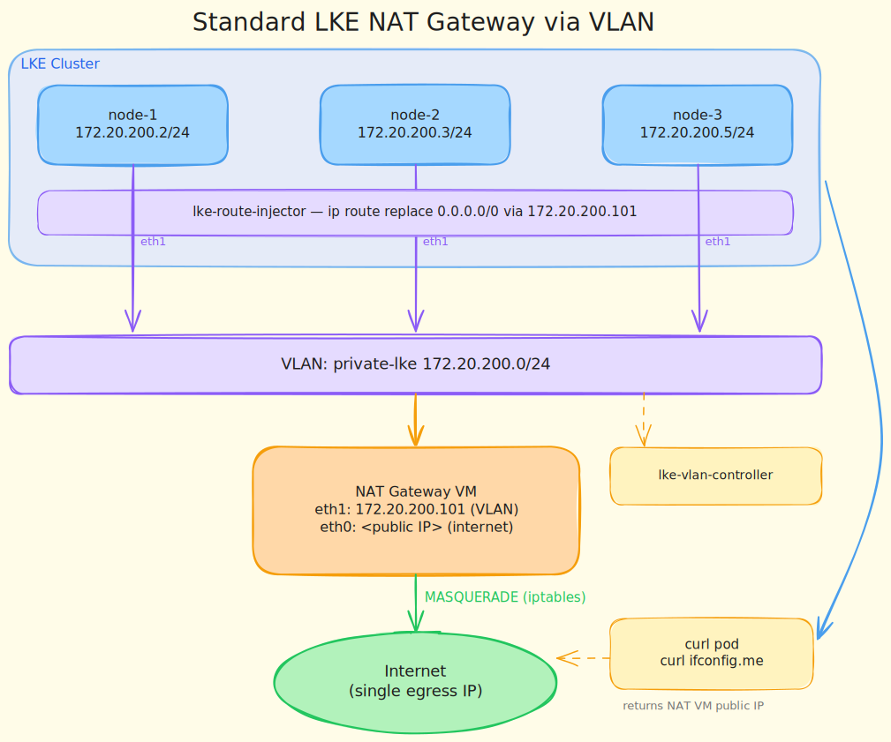

# Use Cases

Practical end-to-end scenarios that combine the charts and Makefile targets in this repository.

---

## Use Case 1 — LKE NAT Gateway via VLAN

Route all outbound traffic from an LKE cluster through a dedicated Linode VM acting as a NAT gateway. Cluster nodes reach the internet through the VM's public IP, which is useful when you need a **single, predictable egress IP** for allowlisting in firewalls, third-party APIs, or compliance requirements.



### Step 1 — Create the LKE cluster

```bash
make create-lke CLUSTER_LABEL=my-cluster REGION=de-fra-2 NODE_COUNT=3
make kubeconfig CLUSTER_LABEL=my-cluster
export KUBECONFIG=$(pwd)/kubeconfig-my-cluster.yaml
```

### Step 2 — Create the NAT gateway VM

The VM is created with a public interface (`eth0`) and a VLAN interface (`eth1`) pre-attached. Assign it the gateway IP of your chosen VLAN subnet.

```bash
make create-vlan-vm \
  VM_LABEL=nat-gateway \
  VLAN_LABEL=private-lke \
  VLAN_IP=172.20.200.1/24
```

### Step 3 — Configure the VM as a NAT gateway

```bash
make nat-gateway-setup VM_LABEL=nat-gateway
```

SSH into the VM and run the printed commands. They enable IP forwarding and install the `iptables` MASQUERADE rule so traffic arriving on `eth1` (VLAN) is forwarded out `eth0` (public) with the VM's public IP.

### Step 4 — Attach the VLAN interface to every LKE node

Deploy `lke-vlan-controller`. It will automatically detect each LKE node, assign it a free IP from the VLAN subnet, update the Linode config, and perform a rolling reboot to activate the interface.

```bash
helm upgrade --install lke-vlan-controller charts/lke-vlan-controller \
  --namespace lke-vlan-controller \
  --create-namespace \
  --set vlan.name=private-lke \
  --set vlan.cidr=172.20.200.0/24 \
  --set linodeToken=$LINODE_TOKEN \
  --set-json 'vlan.excludedIPs=["172.20.200.1"]'
```

The `excludedIPs` entry reserves the gateway VM's VLAN IP so the controller never assigns it to a cluster node.

Wait until all nodes have the `vlan-ip` label:

```bash
kubectl get nodes -L vlan-ip,lke-vlan-controller-status
```

### Step 5 — Inject the default route on every LKE node

Deploy `lke-route-injector` to replace the default route on each node, steering all outbound traffic through the NAT gateway VM. Scope it to VLAN-enabled nodes only via `nodeSelector`.

```bash
helm upgrade --install lke-route-injector charts/lke-route-injector \
  --namespace lke-route-injector \
  --create-namespace \
  --set 'routes[0].network=0.0.0.0/0' \
  --set 'routes[0].gateway=172.20.200.1' \
  --set 'deployment.nodeSelector.lke-vlan-controller-status=completed'
```

The `nodeSelector` ensures the route injector only runs on nodes where `lke-vlan-controller` has completed the VLAN setup and reboot.

> **Note:** The Kubernetes API server must remain reachable after the default route changes. LKE control plane traffic uses the cluster's internal network, which is unaffected. If you use a Control Plane ACL (LKE Enterprise), ensure the NAT gateway VM's public IP is in the allowlist.

### Step 6 — Verify egress IP

Run a one-shot debug pod that queries `ifconfig.me` and verifies the returned IP matches the NAT gateway VM's public IP.

```bash
make verify-nat-gw NAT_GW_IP=<nat-gateway-public-ip>
```

Expected output: `PASS: outbound traffic is exiting via the NAT gateway (<ip>)`.

### Teardown

```bash
helm uninstall lke-route-injector -n lke-route-injector
helm uninstall lke-vlan-controller -n lke-vlan-controller
make delete-vlan-vm VM_LABEL=nat-gateway
make delete-lke CLUSTER_LABEL=my-cluster
```

---

## Adding more use cases

Other scenarios that follow the same building blocks:

| Use Case | What changes |
|---|---|
| **VPN gateway** | VM runs WireGuard or OpenVPN instead of plain iptables NAT; route injector steers only VPN-bound CIDRs (not `0.0.0.0/0`) |
| **Private service mesh** | Route specific RFC-1918 ranges (e.g. `10.0.0.0/8`) through the VLAN — no default route replacement needed |
| **Multi-cluster east-west** | Two LKE clusters share the same VLAN; route injector on each side points pod CIDRs at the other cluster's gateway node |
| **Egress per namespace** | Deploy multiple `lke-route-injector` releases with different `nodeSelector` values targeting node pools dedicated to specific namespaces |
