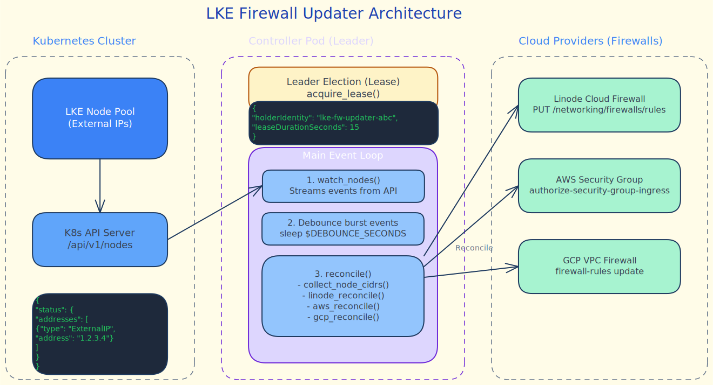

# lke-firewall-updater

Keeps your cloud firewalls (Linode, AWS, or GCP) in sync with the public IPs of your Kubernetes nodes.

- **Event-Driven** — watches the Kubernetes API for node changes (join/leave/IP change) and updates firewall rules in near real-time.
- **Multi-Cloud** — supports Linode Cloud Firewalls, AWS Security Groups, and GCP VPC Firewall Rules simultaneously.
- **Leader Election** — runs as a highly-available Deployment; only the leader pod performs reconciliations.
- **Node Labeling** — optionally labels nodes after a successful firewall update, enabling `nodeSelector`-based scheduling that only places workloads on firewall-ready nodes.

The managed firewall rules are named **`lke-nodes-{cluster_id}`** automatically.



---

## Requirements & Provider Setup

### 1. Linode Cloud Firewalls

- **API Token**: Create a [Personal Access Token](https://cloud.linode.com/profile/tokens) with `Firewalls: Read/Write` scope.
- **Existing Firewall**: Create a firewall in the Cloud Manager. Note the **Firewall ID** (integer).

### 2. AWS Security Groups

- **Security Group**: Create a Security Group in your VPC. Note the **Group ID** (e.g., `sg-0123456789abcdef0`).
- **IAM Permissions**: Create an IAM user with an Access Key and the following inline policy:
  ```json
  {
    "Version": "2012-10-17",
    "Statement": [
      {
        "Effect": "Allow",
        "Action": [
          "ec2:DescribeSecurityGroups",
          "ec2:AuthorizeSecurityGroupIngress",
          "ec2:RevokeSecurityGroupIngress"
        ],
        "Resource": "*"
      }
    ]
  }
  ```

### 3. GCP VPC Firewall Rules

- **Firewall Rule**: Create a VPC firewall rule. Note the **Name**.
- **Service Account**: Create a Service Account and grant it the `roles/compute.securityAdmin` role (or a custom role with `compute.firewalls.update` and `compute.firewalls.get`).
- **JSON Key**: Download the Service Account JSON key file.

---

## Installation

### Basic (Linode only)
```bash
helm upgrade --install lke-fw-updater charts/lke-firewall-updater \
  --namespace lke-firewall-updater \
  --create-namespace \
  --set providers.linode.token=<TOKEN> \
  --set-json 'providers.linode.firewall.ids=[12345]'
```

### Multi-Cloud (Linode + AWS)
```bash
helm upgrade --install lke-fw-updater charts/lke-firewall-updater \
  --namespace lke-firewall-updater \
  --create-namespace \
  --set providers.linode.token=<TOKEN> \
  --set-json 'providers.linode.firewall.ids=[12345]' \
  --set providers.aws.enabled=true \
  --set providers.aws.region=us-east-1 \
  --set providers.aws.accessKeyId=<AWS_KEY> \
  --set providers.aws.secretAccessKey=<AWS_SECRET> \
  --set-json 'providers.aws.securityGroupIds=["sg-12345"]'
```

---

## Configuration

| Parameter | Description | Default |
|---|---|---|
| `nodes.labelSelector` | Kubernetes label selector for filtering nodes | `""` |
| `nodeLabeling.enabled` | Label nodes after each successful firewall reconcile | `false` |
| `nodeLabeling.labelKey` | Label key applied to nodes | `firewall.lke.linode.com/ready` |
| `nodeLabeling.labelValue` | Label value applied to nodes | `"true"` |
| `controller.replicas` | Number of controller pods (standby pods wait for leader) | `2` |
| `controller.debounceSeconds` | Seconds to wait after a watch event before reconciling | `3` |
| `controller.reconcileInterval` | Safety-net full reconcile interval (seconds) | `300` |
| `rule.name` | Fallback rule name (auto-detected as `lke-nodes-{cluster_id}`) | `lke-nodes` |
| `rule.protocol` | Protocol (`TCP` or `UDP`) | `TCP` |
| `rule.ports` | Port range — single (`443`), range (`1-65535`), or CSV (`80,443`) | `1-65535` |
| `rule.action` | Rule action (`ACCEPT`/`DROP`). Linode only. | `ACCEPT` |
| `providers.linode.enabled` | Manage Linode Cloud Firewalls | `true` |
| `providers.linode.token` | Linode API token | `""` |
| `providers.linode.existingSecret` | Name of pre-existing Secret containing the token | `""` |
| `providers.linode.firewall.ids` | List of Linode Firewall IDs (integers) | `[]` |
| `providers.aws.enabled` | Manage AWS Security Groups | `false` |
| `providers.aws.region` | AWS region | `""` |
| `providers.aws.accessKeyId` | AWS Access Key ID | `""` |
| `providers.aws.secretAccessKey` | AWS Secret Access Key | `""` |
| `providers.aws.existingSecret` | Name of pre-existing Secret with AWS credentials | `""` |
| `providers.aws.securityGroupIds` | List of Security Group IDs | `[]` |
| `providers.gcp.enabled` | Manage GCP VPC Firewall Rules | `false` |
| `providers.gcp.projectId` | GCP Project ID | `""` |
| `providers.gcp.firewallRuleName` | Name of the VPC firewall rule | `""` |
| `providers.gcp.serviceAccountJson` | Inline Service Account JSON key | `""` |
| `providers.gcp.existingSecret` | Name of pre-existing Secret with `key.json` | `""` |

---

## Architecture

For a detailed visual overview of the event loop, leader election, and multi-cloud reconciliation flow, see [lke-firewall-updater.excalidraw](lke-firewall-updater.excalidraw) (open in [Excalidraw](https://excalidraw.com) or compatible editor).

---

## How it works

The controller acquires a **Kubernetes Lease** to ensure a single active leader. Only the leader pod watches the Kubernetes Node API and updates firewalls; standby replicas wait on standby for failover.

### Event Loop (inside the leader pod)

1. **Watch Stream** — opens a live watch on `/api/v1/nodes` and listens for ADDED, MODIFIED, and DELETED events.
2. **Debounce Window** — when an event fires, the controller writes a trigger file and waits `debounceSeconds` (default: `3`) before proceeding. This window absorbs burst events (e.g., 10 nodes booting simultaneously) into a single reconciliation, preventing resource waste and API rate limit issues.
3. **Collect Node IPs** — after the debounce window closes, collect all `ExternalIP` addresses from nodes matching `labelSelector`.
4. **Atomic Update** — iterate through all enabled providers (Linode, AWS, GCP) in sequence and atomically update firewall rules to match the collected IP set. All providers see the same IP list from the same moment in time.
5. **Safety Reconciliation** — independent of node watch events, a full reconciliation runs every `reconcileInterval` (default: `300` seconds) as a safety net to catch any drift.

### Leader Election & High Availability

The controller runs as a Deployment with `replicas >= 1`. Replicas compete for a Kubernetes Lease named `lke-firewall-updater-leader`:
- **Lease holder** (leader): Actively performs reconciliations.
- **Non-leaders**: Sleep and wait to acquire the lease if the current leader crashes.
- **Lease renewal**: Leader renews the lease every `renewIntervalSeconds` (default: `10` seconds). If a leader crashes or becomes unresponsive, a standby pod acquires the lease within `leaseDurationSeconds` (default: `30` seconds).

### Timing Example

Suppose 10 nodes boot simultaneously:
- **t=0s**: Node 1 ADDED event fires → debounce trigger written, controller sleeps.
- **t=0.5s**: Nodes 2–10 ADDED events fire → already sleeping, no action.
- **t=3s**: Debounce window closes → collect all 10 ExternalIPs, update Linode, AWS, and GCP firewalls once with the full set.
- **t=300s**: Safety reconciliation fires independently of node events.

Without debouncing, the same work (updating all 3 providers) would run 10 times in rapid succession, wasting API quota and risking rate limit errors.

### Firewall Rule Naming & Management

The firewall rule created and managed by this controller is named **`lke-nodes-{cluster_id}`**, where `cluster_id` is derived from the cluster's unique identifier. The rule does not need to pre-exist; the chart creates it automatically on the first node boot.

---

## Node Labeling

Enable this feature to label nodes only after their IP has been successfully added to the cloud firewall. This lets you gate pod scheduling on firewall readiness — useful when a workload must not be reachable before the firewall rule is in place.

### Enable in values

```yaml
nodeLabeling:
  enabled: true
  labelKey: "firewall.lke.linode.com/ready"   # default
  labelValue: "true"                           # default
```

### Gate pod scheduling

```yaml
spec:
  nodeSelector:
    firewall.lke.linode.com/ready: "true"
```

Or with `nodeAffinity` for clearer pending-pod error messages:

```yaml
spec:
  affinity:
    nodeAffinity:
      requiredDuringSchedulingIgnoredDuringExecution:
        nodeSelectorTerms:
          - matchExpressions:
              - key: firewall.lke.linode.com/ready
                operator: In
                values:
                  - "true"
```

### How it works

After each successful reconcile across all enabled providers, the controller patches every node matching `nodes.labelSelector` with the configured label. The operation is idempotent — already-labeled nodes are skipped. If the label is manually removed, it is reapplied on the next reconcile cycle (default: every 5 minutes).

Enabling this feature adds the `patch` verb on `nodes` to the controller's ClusterRole automatically.

---

## AWS Rule Management

The controller tracks which Security Group rules it owns using the `Description` field on each CIDR entry (auto-set to the cluster rule name, e.g. `lke-nodes-587385`). This enables automatic cleanup: when `rule.ports` changes, rules for port specs no longer in the configuration are revoked automatically on the next reconcile.

> **Important — do not change `rule.name`** (or any value that alters the auto-detected cluster rule name) without manual cleanup first. The controller identifies its own rules by description. If the description changes, the old rules become invisible to the controller and will not be updated or removed automatically. You must delete them manually from the AWS console before or after the rename.

The same limitation applies to the initial deployment: any Security Group rules created before description tracking was introduced have no `Description` and are not managed by the controller. Delete them manually once the controller has re-created them with the correct description.

---

## Troubleshooting

### Check if the controller is running and healthy

```bash
# Check pod status
kubectl -n lke-firewall-updater get pods -o wide

# Check logs (leader pod should show reconciliation activity)
kubectl -n lke-firewall-updater logs -f <pod-name>

# Verify leader election
kubectl -n lke-firewall-updater get lease lke-firewall-updater-leader -o jsonpath='{.spec.holderIdentity}'
```

### Verify node IPs are being collected

```bash
# Get nodes and their ExternalIPs
kubectl get nodes -o wide

# The controller log should show collected IPs after each debounce window
kubectl -n lke-firewall-updater logs <leader-pod-name> | grep -i "external\|collected"
```

### Check cloud provider connectivity

**Linode**:
```bash
# Verify token has Firewalls:Read/Write scope
curl -H "Authorization: Bearer $LINODE_TOKEN" https://api.linode.com/v4/firewalls
```

**AWS**:
```bash
# Verify IAM credentials and security group access
aws ec2 describe-security-groups --group-ids sg-12345 --region us-east-1
```

**GCP**:
```bash
# Verify service account has compute.securityAdmin role
gcloud compute firewall-rules describe <rule-name> --project <project-id>
```

### Controller is not reconciling / firewall rules are stale

1. **Check the leader pod is healthy**:
   ```bash
   kubectl -n lke-firewall-updater describe pod <leader-pod-name>
   ```

2. **Verify configuration is loaded**:
   ```bash
   kubectl -n lke-firewall-updater get configmap lke-firewall-updater-scripts -o jsonpath='{.data.controller\.sh}' | head -50
   ```

3. **Force a reconciliation** by scaling the controller down and up (triggers a new lease acquisition):
   ```bash
   kubectl -n lke-firewall-updater scale deployment lke-firewall-updater --replicas=0
   sleep 2
   kubectl -n lke-firewall-updater scale deployment lke-firewall-updater --replicas=2
   ```

4. **Check debounce and reconciliation timings** in the logs:
   ```bash
   kubectl -n lke-firewall-updater logs <pod> | grep -E "debounce|reconcil|ADDED|MODIFIED"
   ```

### Rate limit errors from cloud providers

If you see errors like `RateLimitExceeded`, it typically means the controller is reconciling too frequently:

1. **Increase the debounce window** to absorb more burst events:
   ```bash
   helm upgrade lke-fw-updater charts/lke-firewall-updater \
     -n lke-firewall-updater \
     --set controller.debounceSeconds=10
   ```

2. **Increase the safety reconciliation interval** to reduce background polling:
   ```bash
   helm upgrade lke-fw-updater charts/lke-firewall-updater \
     -n lke-firewall-updater \
     --set controller.reconcileInterval=600
   ```
