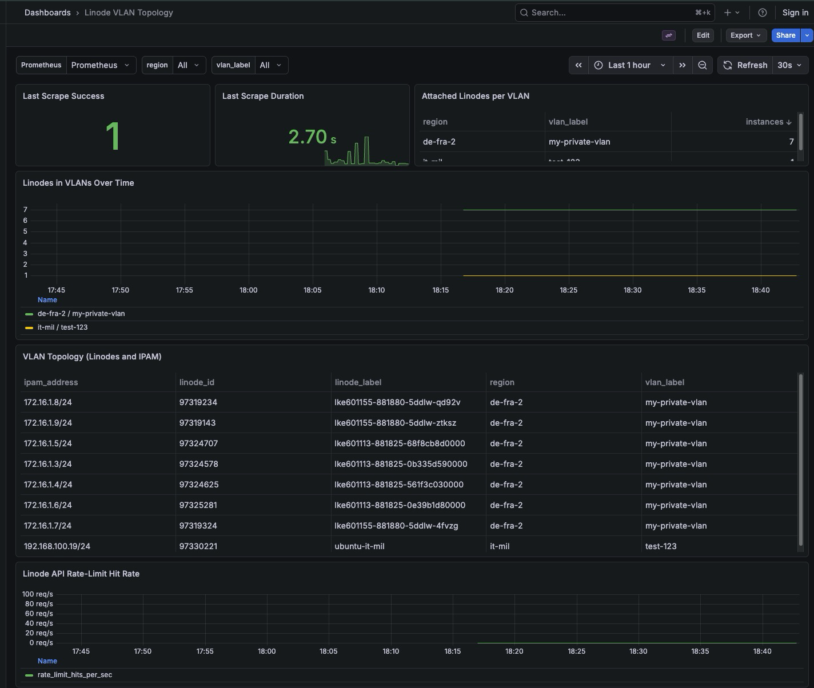

# pylinode-vlan-topology-exporter

Prometheus exporter that scans Linode VLAN topology and exposes VLAN-to-Linode attachment data for Grafana dashboards.

## Token permissions

`LINODE_TOKEN` should have:

- `linodes:read_only`

The exporter only performs read operations.

## Why this design

- Fast topology seed via `GET /networking/vlans` (returns VLAN labels/regions and attached Linode IDs).
- Per-Linode config lookup is still required to get VLAN `ipam_address`:
  - `GET /linode/instances/{id}/configs`
- The exporter parallelizes per-Linode requests with a worker pool to handle up to 10 VLANs and ~1000 instances efficiently.

## APIs used

- `GET /networking/vlans`
- `GET /linode/instances/{id}`
- `GET /linode/instances/{id}/configs`
- `GET /linode/instances/{id}/interfaces`

From current OpenAPI docs, there is no single endpoint that returns VLAN + all attached interface IPAMs in one call for legacy config profiles, so per-Linode config reads remain necessary.

The exporter supports both models:

- legacy config profile interfaces (`/linode/instances/{id}/configs`)
- new Linode interfaces (`/linode/instances/{id}/interfaces`)

## Local run

```bash
uv sync

export LINODE_TOKEN="<token>"
export SCRAPE_INTERVAL_SECONDS="60"
export METRICS_PORT="9108"
export MAX_WORKERS="32"
export MAX_RPS="15"
export VLAN_LABEL_FILTER=""  # optional prefix filter

uv run pylinode-vlan-topology-exporter
```

Then open:

- `http://localhost:9108/metrics`

## Docker

Build local image:

```bash
docker build -t pylinode-vlan-topology-exporter:dev .
```

Run container:

```bash
docker run --rm -it \
  -e LINODE_TOKEN="<token>" \
  -e SCRAPE_INTERVAL_SECONDS="60" \
  -e MAX_WORKERS="32" \
  -e MAX_RPS="15" \
  -e METRICS_PORT="9108" \
  -p 9108:9108 \
  pylinode-vlan-topology-exporter:dev
```

Run from GHCR:

```bash
docker run --rm -it \
  -e LINODE_TOKEN="<token>" \
  -e SCRAPE_INTERVAL_SECONDS="60" \
  -e MAX_WORKERS="32" \
  -e MAX_RPS="15" \
  -e METRICS_PORT="9108" \
  -p 9108:9108 \
  ghcr.io/ram-pi/pylinode-vlan-topology-exporter:latest
```

## Docker Compose (Prometheus + Grafana + Exporter)

This project includes a local test stack without Alertmanager:

- `docker-compose.yml`
- `prometheus.yml`
- `grafana/provisioning/*`
- `grafana/dashboards/vlan-topology-dashboard.json`

Run it:

```bash
export LINODE_TOKEN="<token>"
docker compose up -d --build
```

The exporter image is built locally by Compose from `Dockerfile` (no GHCR pull required).

Open:

- Exporter: `http://localhost:9108/metrics`
- Prometheus: `http://localhost:9090`
- Grafana: `http://localhost:3000`

## How parallel collection works

- The exporter does one seed call to list VLANs, then creates one job per attached Linode.
- Jobs run in a `ThreadPoolExecutor` with `MAX_WORKERS` threads.
- Each job fetches Linode config data and extracts VLAN interfaces/IPAM.
- Main thread waits on all futures via `as_completed(...)`, merges all partial results, then publishes one complete metric snapshot.
- Metrics are cleared and rewritten each cycle, so Prometheus sees a consistent end-of-cycle state.

## Metrics

- `linode_vlan_scrape_success`
- `linode_vlan_scrape_duration_seconds`
- `linode_vlan_api_rate_limit_hits_total`
- `linode_vlan_info{vlan_label,region}`
- `linode_vlan_linode_count{vlan_label,region}`
- `linode_vlan_attachment{vlan_label,region,linode_id,linode_label,config_id,interface_id,source,ipam_address}`

## Performance tuning

Estimated scrape time for 10 VLANs x 100 Linodes (about 1000 attached Linodes):

- API calls per cycle (worst-case cold cache):
  - 1 x `GET /networking/vlans`
  - 1000 x `GET /linode/instances/{id}/configs`
  - 1000 x `GET /linode/instances/{id}`
- API calls per cycle (warm cache):
  - 1 x `GET /networking/vlans`
  - 1000 x `GET /linode/instances/{id}/configs`

Rough timing guidance with `MAX_WORKERS=32`:

- Typical: 10-25 seconds
- Slower networks / API pressure: 25-60 seconds
- With retries/rate pressure: 60+ seconds

Recommendation:

- A 60s scrape interval is still reasonable for 10x100 in many environments.
- If `linode_vlan_scrape_duration_seconds` approaches interval frequently, increase interval to 90-120s and/or tune `MAX_WORKERS`.

`MAX_WORKERS` meaning:

- `MAX_WORKERS` is the number of parallel worker threads used for per-Linode API fetches (`/linode/instances/{id}/configs` and uncached label lookups).
- Higher values can reduce scrape duration for large fleets, but may increase API pressure and retries.
- Start at `32`; consider `48` or `64` only if scrape duration remains high and API reliability is still good.

Rate limiting:

- `MAX_RPS` caps total outbound Linode API request rate (default `15` requests/second).
- Keep this enabled to reduce risk of hitting account/API limits.
- If scrape duration is too high, increase `MAX_WORKERS` first, then carefully increase `MAX_RPS`.
- Linode API responses include rate-limit headers (for example `X-RateLimit-*` / remaining/reset signals). See official docs: https://techdocs.akamai.com/linode-api/reference/rate-limits

- Increase `MAX_WORKERS` for larger fleets (e.g. 64) if API limits and latency permit.
- Keep `SCRAPE_INTERVAL_SECONDS` at 30-120s depending on freshness needs.
- Use `VLAN_LABEL_FILTER` to limit scope when you only need specific VLAN families.
- Cache Linode labels in-memory (already implemented) to reduce repeated instance lookups.

## Sample dashboard

A sample Grafana dashboard is provided at:

- `pylinode-vlan-topology-exporter/grafana/dashboards/vlan-topology-dashboard.json`

It includes:

- filtered tables for VLAN counts and topology (without `job`/`instance` columns)
- growth timeseries (`Linodes in VLANs Over Time`)
- API pressure timeseries (`Linode API Rate-Limit Hit Rate`)


